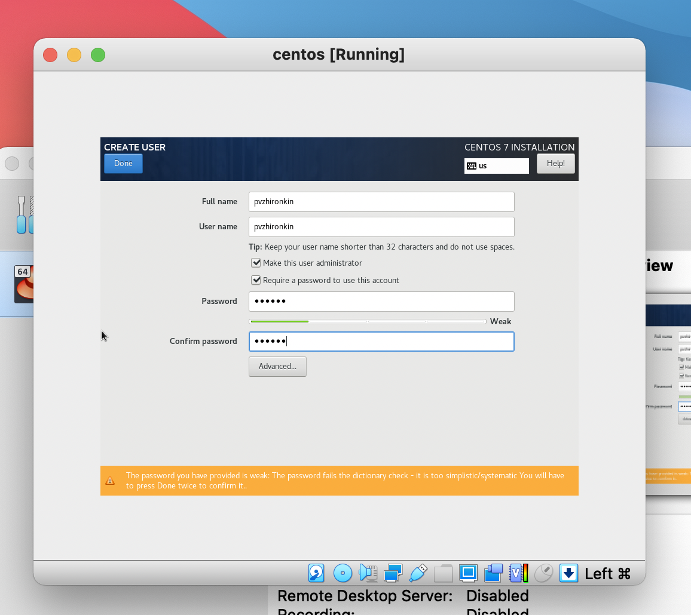

---
# Front matter
lang: ru-RU
title: "Лабораторная работа №1"
subtitle: "Установка и кофигурация операционной системы на виртуальную машину"
author: "Жиронкин Павел Владимирович НПИбд-01-18"

# Formatting
toc-title: "Содержание"
toc: true # Table of contents
toc_depth: 2
lof: true # List of figures
fontsize: 12pt
linestretch: 1.5
papersize: a4paper
documentclass: scrreprt
polyglossia-lang: russian
polyglossia-otherlangs: english
mainfont: PT Serif
romanfont: PT Serif
sansfont: PT Sans
monofont: PT Mono
mainfontoptions: Ligatures=TeX
romanfontoptions: Ligatures=TeX
sansfontoptions: Ligatures=TeX,Scale=MatchLowercase
monofontoptions: Scale=MatchLowercase
indent: true
pdf-engine: lualatex
header-includes:
  - \linepenalty=10 # the penalty added to the badness of each line within a paragraph (no associated penalty node) Increasing the υalue makes tex try to haυe fewer lines in the paragraph.
  - \interlinepenalty=0 # υalue of the penalty (node) added after each line of a paragraph.
  - \hyphenpenalty=50 # the penalty for line breaking at an automatically inserted hyphen
  - \exhyphenpenalty=50 # the penalty for line breaking at an explicit hyphen
  - \binoppenalty=700 # the penalty for breaking a line at a binary operator
  - \relpenalty=500 # the penalty for breaking a line at a relation
  - \clubpenalty=150 # extra penalty for breaking after first line of a paragraph
  - \widowpenalty=150 # extra penalty for breaking before last line of a paragraph
  - \displaywidowpenalty=50 # extra penalty for breaking before last line before a display math
  - \brokenpenalty=100 # extra penalty for page breaking after a hyphenated line
  - \predisplaypenalty=10000 # penalty for breaking before a display
  - \postdisplaypenalty=0 # penalty for breaking after a display
  - \floatingpenalty = 20000 # penalty for splitting an insertion (can only be split footnote in standard LaTeX)
  - \raggedbottom # or \flushbottom
  - \usepackage{float} # keep figures where there are in the text
  - \usepackage{amsmath}
  - \floatplacement{figure}{H} # keep figures where there are in the text
---

# Цель работы

Приобретение практических навыков установки операционной системы на виртуальную машину, настройки минимально необходимых для дальнейшей работы сервисов.

# Выполнение лабораторной работы

Перед началом выполнения работы я установил Virtual Box и скачал образ centos7 для установки.

Затем, открыв Virtual Box, я начал создание виртуальной машины. (рис. [-@fig:001])

{ #fig:001 width=70% }

Дальше установил размер RAM.  (рис. [-@fig:002])

{ #fig:002 width=70% }

После этого необходимо выбрать пункт создания нового виртуального жесткого диска. (рис. [-@fig:003])

{ #fig:003 width=70% }

Установил тип диска VDI. (рис. [-@fig:004])

{ #fig:004 width=70% }

Сделал его динамически расширяемым, чтобы он мог увеличить свой обхем в случае необходимости. (рис. [-@fig:005])

{ #fig:005 width=70% }

Затем определил папку для хранения диска и его лимит объема. (рис. [-@fig:006])

{ #fig:006 width=70% }

На этом первичная настройка виртуально машины завершена. После этого я подключил образ Centos к виртуальной машине. (рис. [-@fig:007])

{ #fig:007 width=70% }

И приступил к установке Centos. 

Выбрал язык системы. (рис. [-@fig:008])

{ #fig:008 width=70% }

Установил дату и время. (рис. [-@fig:009])

{ #fig:009 width=70% }

Перешл к пункту определния пакетов для установки. Выбрал сервер с графическим интерфейсом и далее инструменты для разработки. (рис. [-@fig:010])

{ #fig:010 width=70% }

Определил диск для установки системы. (рис. [-@fig:011])

{ #fig:011 width=70% }

Подключил интернет. (рис. [-@fig:012])

{ #fig:012 width=70% }

Отключил kdump. Все настройки на данном этапе выполнены. (рис. [-@fig:013])

{ #fig:013 width=70% }

Далее задал пароль root и создал пользователя под своим логином с правами администратора. (рис. [-@fig:014])

{ #fig:014 width=70% }

Началась установка Centos. (рис. [-@fig:015])

{ #fig:015 width=70% }

После установки необходимо принять лицензионное соглашение и перезагрузить виртуальную машину. (рис. [-@fig:016])

{ #fig:016 width=70% }

После перезагрузки необходимо залогиниться под созданным пользователем. (рис. [-@fig:017])

{ #fig:017 width=70% }

Centos установлен. (рис. [-@fig:018])

{ #fig:018 width=70% }

Последним этапом работы является установление драйверов оптимизации. Для этого необходимо ввести пароль. (рис. [-@fig:019]).
После этого начнется установка драйверов. Завершение установки является окончанием выполнения лабораторной работы.

{ #fig:019 width=70% }

# Выводы

После выполнения работы я приобрел практические навыки установки операционной системы на виртуальную машину и настройки минимально необходимых для дальнейшей работы сервисов.
