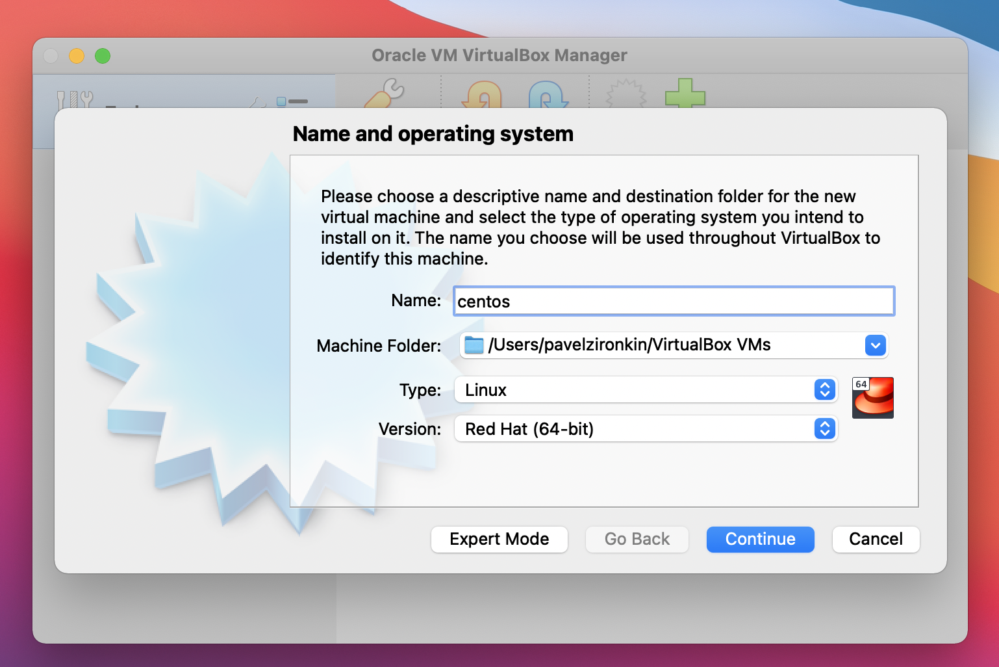
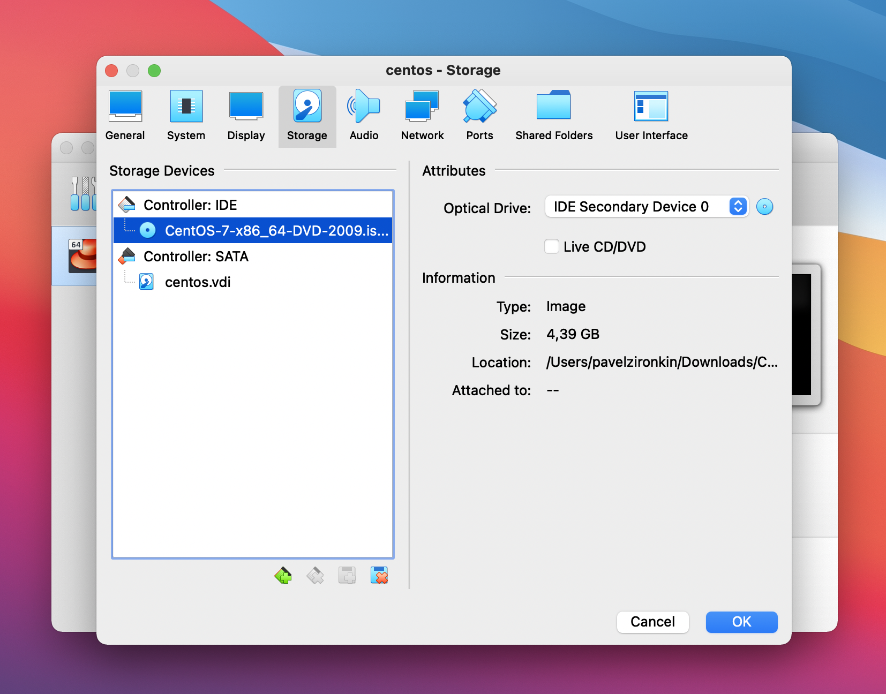
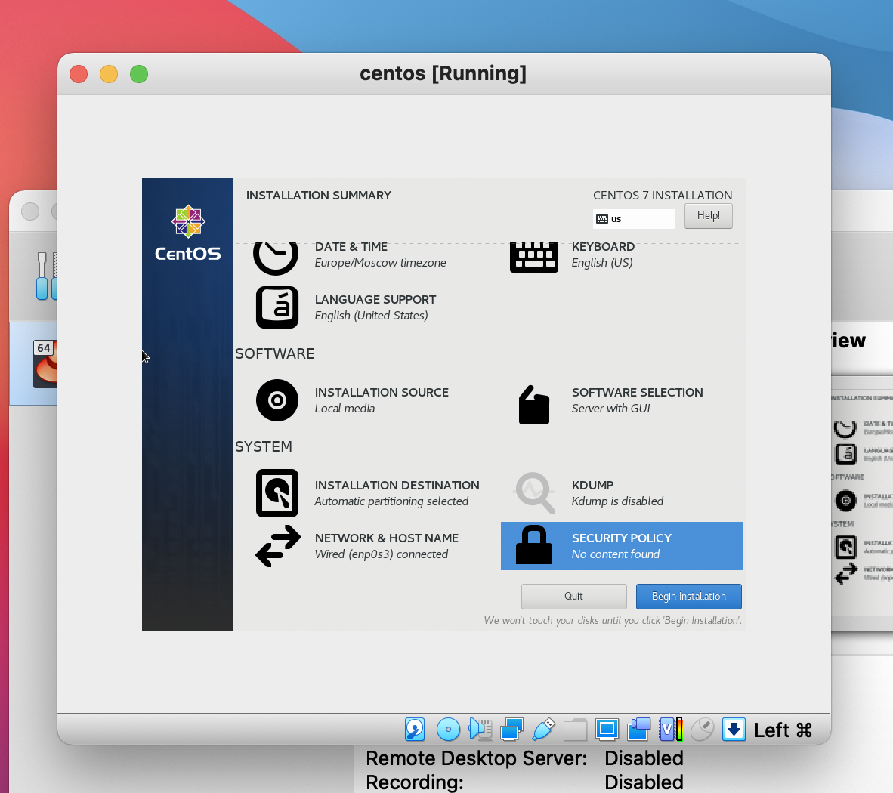
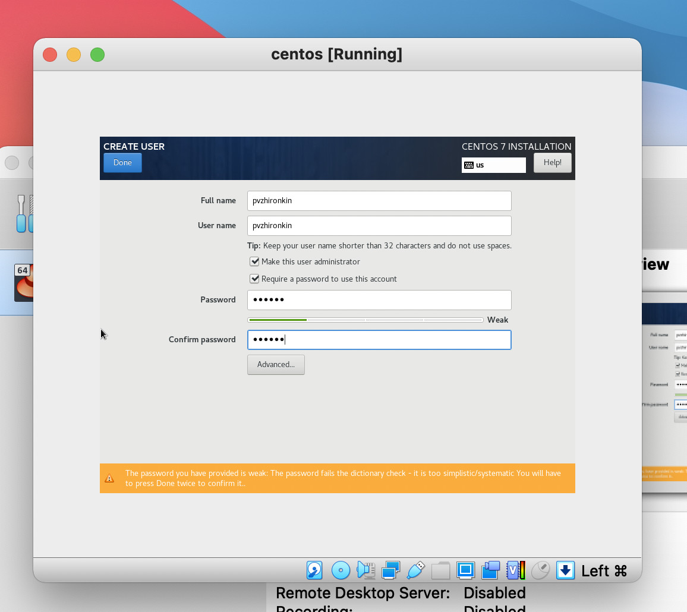

---
## Front matter
lang: ru-RU
title: Отчет по лабораторной работе №1
author: |
	 Жиронкин Павел Владимирович НПИбд-01-18\inst{1}

institute: |
	\inst{1}Российский Университет Дружбы Народов

date: Информационная Безопасность--2021,  15 сентября, 2021, Москва, Россия

## Formatting
mainfont: PT Serif
romanfont: PT Serif
sansfont: PT Sans
monofont: PT Mono
toc: false
slide_level: 2
theme: metropolis
header-includes: 
 - \metroset{progressbar=frametitle,sectionpage=progressbar,numbering=fraction}
 - '\makeatletter'
 - '\beamer@ignorenonframefalse'
 - '\makeatother'
aspectratio: 43
section-titles: true

---

# Цели и задачи работы

## Цель лабораторной работы

Приобрести практические навыки установки операционной системы на виртуальную машину, настройки минимально необходимых для дальнейшей работы сервисов.

## Задание к лабораторной работе

Лабораторная работа подразумевает установку на виртуальную машину VirtualBox операционной системы Linux, дистрибутив Centos.

# Процесс выполнения лабораторной работы

## Процесс выполнения

1. Создал новую виртуальную машину. Для этого в VirtualBox выбрал Машина -> Создать.
Указал имя виртуальной машины — centos, тип операционной системы — Linux, RedHat. Указал размер основной памяти виртуальной машины — 1024 мб.

{width=70% height=70% }

2.  Задал конфигурацию жёсткого диска — загрузочный, VDI (BirtualBox Disk Image), динамический виртуальный диск.

3. Задал размер диска — 20 ГБ

## Процесс выполнения

4. Выбрал в VirtualBox Свойства Носители виртуальной машины Base.
Добавил новый привод оптических дисков и выбрал образ.

{width=70% height=70% }

## Процесс выполнения

5. Запустил виртуальную машину Centos, выбрал установку системы на жёсткий диск.

6. Установил английский язык для интерфейса и раскладки клавиатуры

7. В качестве имени машины указал "pvzhironkin.localdomain" . Указал часовой пояс «Москва»

8. Установил пароль для root

## Процесс выполнения

Результат после выполнения предыдущих настроек.

{width=70% height=70% }

## Процесс выполнения

9. Создал пользователя pvzhironkin.

{width=70% height=70% }

## Процесс выполнения

10. Завершил установку операционной системы  и перезагрузил её.

11. Запустил виртуальную машину centos.

12. Для оптимизации работы в операционной системе установил необходимые драйвера.

# Выводы по проделанной работе

## Вывод

На основе проделанной работы приобрел практические навыки установки операционной системы на виртуальную машину, настройки минимально необходимых для дальнейшей работы сервисов.
