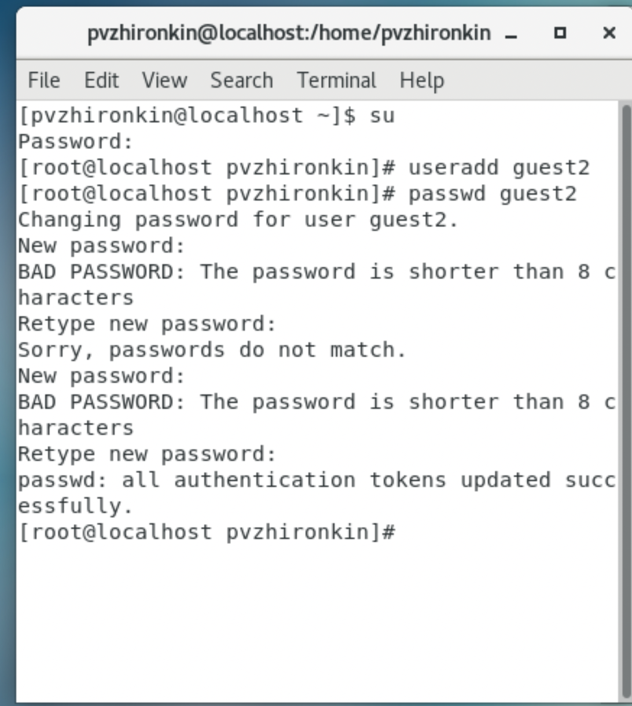
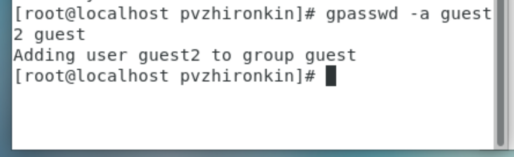
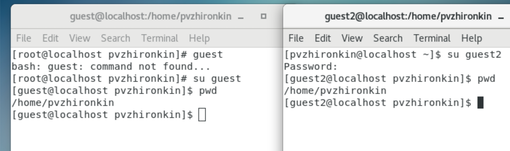
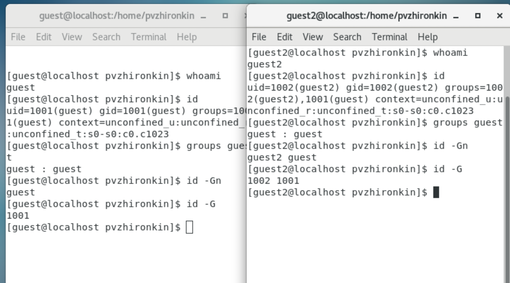
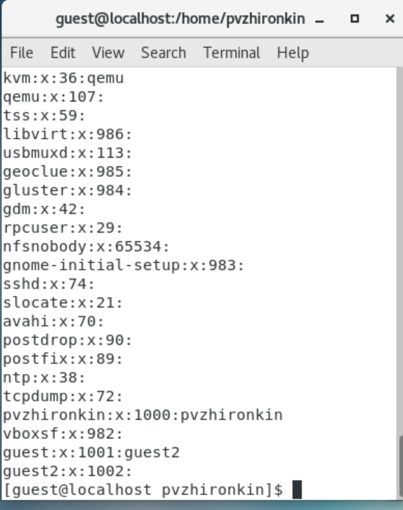
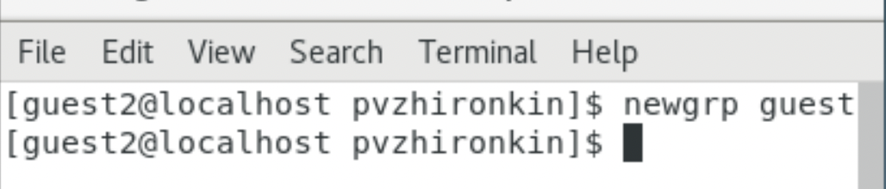
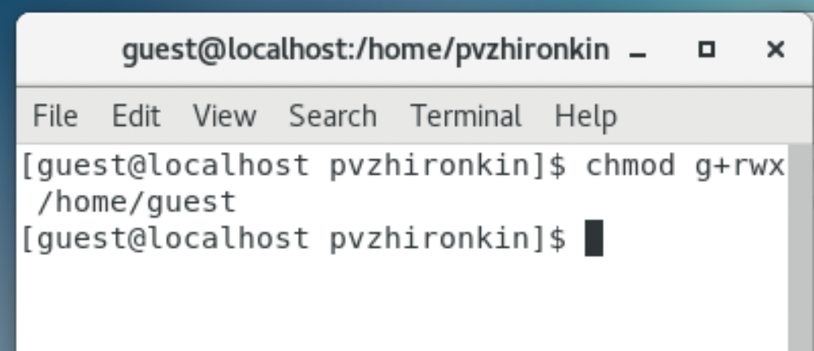
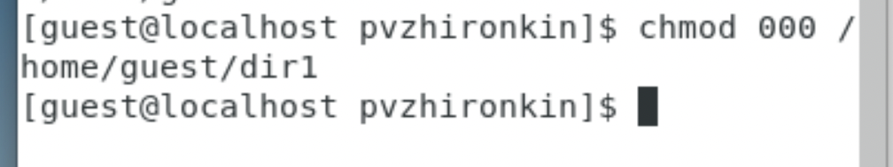
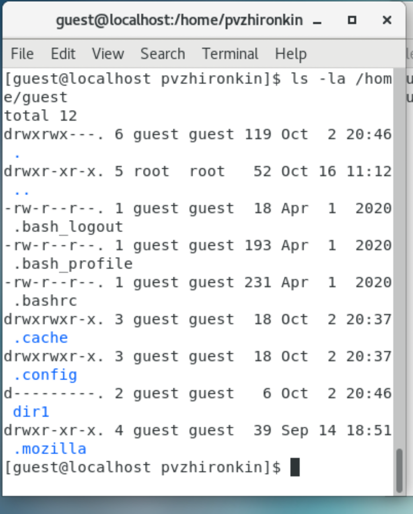

---
# Front matter
lang: ru-RU
title: "Отчет по лабораторной работе №3"
subtitle: "Информационная безопасноть"
author: "Жиронкин Павел Владимирович НПИбд-01-18"

# Formatting
toc-title: "Содержание"
toc: true # Table of contents
toc_depth: 2
lof: true # List of figures
lot: true # List of tables
fontsize: 12pt
linestretch: 1.5
papersize: a4paper
documentclass: scrreprt
polyglossia-lang: russian
polyglossia-otherlangs: english
mainfont: PT Serif
romanfont: PT Serif
sansfont: PT Sans
monofont: PT Mono
mainfontoptions: Ligatures=TeX
romanfontoptions: Ligatures=TeX
sansfontoptions: Ligatures=TeX,Scale=MatchLowercase
monofontoptions: Scale=MatchLowercase
indent: true
pdf-engine: lualatex
header-includes:
  - \linepenalty=10 # the penalty added to the badness of each line within a paragraph (no associated penalty node) Increasing the υalue makes tex try to haυe fewer lines in the paragraph.
  - \interlinepenalty=0 # υalue of the penalty (node) added after each line of a paragraph.
  - \hyphenpenalty=50 # the penalty for line breaking at an automatically inserted hyphen
  - \exhyphenpenalty=50 # the penalty for line breaking at an explicit hyphen
  - \binoppenalty=700 # the penalty for breaking a line at a binary operator
  - \relpenalty=500 # the penalty for breaking a line at a relation
  - \clubpenalty=150 # extra penalty for breaking after first line of a paragraph
  - \widowpenalty=150 # extra penalty for breaking before last line of a paragraph
  - \displaywidowpenalty=50 # extra penalty for breaking before last line before a display math
  - \brokenpenalty=100 # extra penalty for page breaking after a hyphenated line
  - \predisplaypenalty=10000 # penalty for breaking before a display
  - \postdisplaypenalty=0 # penalty for breaking after a display
  - \floatingpenalty = 20000 # penalty for splitting an insertion (can only be split footnote in standard LaTeX)
  - \raggedbottom # or \flushbottom
  - \usepackage{float} # keep figures where there are in the text
  - \usepackage{amsmath}
  - \floatplacement{figure}{H} # keep figures where there are in the text
---

# Цель работы

Получить практические навыки работы в консоли с атрибутами файлов для групп пользователей.

# Выполнение лабораторной работы

1.  В установленной операционной системе создал учетную запись пользователя guest (используя учетную запись администратора): useradd guest. Задал пароль для пользователя guest: passwd guest. (Это было выполнено в лабораторной работе №2) Аналогично создал второго пользователя guest2. (рис. -@fig:001). 

{ #fig:001 width=70% height=70% }

2. Добавил пользователя guest2 в группу guest: gpasswd -a guest2 guest (рис. -@fig:002). 

{ #fig:002 width=70% height=70% }

3. Осуществил вход в систему от двух пользователей на двух разных консолях: guest на первой консоли и guest2 на второй консоли. Для обоих пользователей командой pwd определил директорию, в которой мы находимся.(рис. -@fig:003). 

{ #fig:003 width=70% height=70% }

4. Уточнил имя пользователя, его группу, кто входит в нее и к каким группам принадлежит он сам. Определил командами groups guest и groups guest2, в какие группы входят пользователи guest и guest2. Сравнил вывод команды groups с выводом команд id -Gn и id -G (Одинаковы)(рис. -@fig:004). 

{ #fig:004 width=70% height=70% }

5. Сравнил полученную информацию с содержимым файла /etc/group. Просмотрел файл командой
cat /etc/group. (рис. -@fig:005).

{ #fig:005 width=70% height=70% }

6. От имени пользователя guest2 выполнил регистрацию пользователя guest2 в группе guest командой:
newgrp guest(рис. -@fig:006).

{ #fig:006 width=70% height=70% }

7. От имени пользователя guest изменил права директории /home/guest, разрешив все действия для пользователей группы: chmod g+rwx /home/guest (рис. -@fig:007). 

{ #fig:007 width=70% height=70% }

8. От имени пользователя guest снял с директории /home/guest/dir1 все атрибуты командой
chmod 000 dir1. (рис. -@fig:008). 

{ #fig:008 width=70% height=70% }

9. Проверил правильность снятия атрибутов. (рис. -@fig:009). 

{ #fig:009 width=50% height=50% }

10. Заполнил таблицу «Установленные права и разрешенные действия для групп», определив, какие операции разрешены, а какие нет. Если операция разрешена, занес в таблицу знак «+», если не разрешена, знак «-». (см. табл. [-@tbl:001])

: Установленные права и разрешённые действия для групп {#tbl:001}

| Права директории | Права файла | Создание файла | Удаление файла | Запись в файл | Чтение файла | Смена директории | Просмотр файлов в директории | Переименование файла | Смена атрибутов файла |
|------------------|-------------|----------------|----------------|---------------|--------------|------------------|------------------------------|----------------------|-----------------------|
| d--- (000)        | --- (000)   | -              | -              | -             | -            | -                | -                            | -                    | -                     |
| d--- (000)        | --x (100)   | -              | -              | -             | -            | -                | -                            | -                    | -                     |
| d--- (000)        | -w- (200)   | -              | -              | -             | -            | -                | -                            | -                    | -                     |
| d--- (000)        | -wx (300)   | -              | -              | -             | -            | -                | -                            | -                    | -                     |
| d--- (000)        | r-- (400)   | -              | -              | -             | -            | -                | -                            | -                    | -                     |
| d--- (000)        | r-x (500)   | -              | -              | -             | -            | -                | -                            | -                    | -                     |
| d--- (000)        | rw- (600)   | -              | -              | -             | -            | -                | -                            | -                    | -                     |
| d--- (000)        | rwx (700)   | -              | -              | -             | -            | -                | -                            | -                    | -                     |
| d--x (100)        | --- (000)   | -              | -              | -             | -            | +                | -                            | -                    | +                     |
| d--x (100)        | --x (100)   | -              | -              | -             | -            | +                | -                            | -                    | +                     |
| d--x (100)        | -w- (200)   | -              | -              | +             | -            | +                | -                            | -                    | +                     |
| d--x (100)        | -wx (300)   | -              | -              | +             | -            | +                | -                            | -                    | +                     |
| d--x (100)        | r-- (400)   | -              | -              | -             | +            | +                | -                            | -                    | +                     |
| d--x (100)        | r-x (500)   | -              | -              | -             | +            | +                | -                            | -                    | +                     |
| d--x (100)        | rw- (600)   | -              | -              | +             | +            | +                | -                            | -                    | +                     |
| d--x (100)        | rwx (700)   | -              | -              | +             | +            | +                | -                            | -                    | +                     |
| d-w- (200)        | --- (000)   | -              | -              | -             | -            | -                | -                            | -                    | -                     |
| d-w- (200)        | --x (100)   | -              | -              | -             | -            | -                | -                            | -                    | -                     |
| d-w- (200)        | -w- (200)   | -              | -              | -             | -            | -                | -                            | -                    | -                     |
| d-w- (200)        | -wx (300)   | -              | -              | -             | -            | -                | -                            | -                    | -                     |
| d-w- (200)        | r-- (400)   | -              | -              | -             | -            | -                | -                            | -                    | -                     |
| d-w- (200)        | r-x (500)   | -              | -              | -             | -            | -                | -                            | -                    | -                     |
| d-w- (200)        | rw- (600)   | -              | -              | -             | -            | -                | -                            | -                    | -                     |
| d-w- (200)        | rwx (700)   | -              | -              | -             | -            | -                | -                            | -                    | -                     |
| d-wx (300)        | --- (000)   | +              | +              | -             | -            | +                | -                            | +                    | +                     |
| d-wx (300)        | --x (100)   | +              | +              | -             | -            | +                | -                            | +                    | +                     |
| d-wx (300)        | -w- (200)   | +              | +              | +             | -            | +                | -                            | +                    | +                     |
| d-wx (300)        | -wx (300)   | +              | +              | +             | -            | +                | -                            | +                    | +                     |
| d-wx (300)        | r-- (400)   | +              | +              | -             | +            | +                | -                            | +                    | +                     |
| d-wx (300)        | r-x (500)   | +              | +              | -             | +            | +                | -                            | +                    | +                     |
| d-wx (300)        | rw- (600)   | +              | +              | +             | +            | +                | -                            | +                    | +                     |
| d-wx (300)        | rwx (700)   | +              | +              | +             | +            | +                | -                            | +                    | +                     |
| dr-- (400)        | --- (000)   | -              | -              | -             | -            | -                | +                            | -                    | -                     |
| dr-- (400)        | --x (100)   | -              | -              | -             | -            | -                | +                            | -                    | -                     |
| dr-- (400)        | -w- (200)   | -              | -              | -             | -            | -                | +                            | -                    | -                     |
| dr-- (400)        | -wx (300)   | -              | -              | -             | -            | -                | +                            | -                    | -                     |
| dr-- (400)        | r-- (400)   | -              | -              | -             | -            | -                | +                            | -                    | -                     |
| dr-- (400)        | r-x (500)   | -              | -              | -             | -            | -                | +                            | -                    | -                     |
| dr-- (400)        | rw- (600)   | -              | -              | -             | -            | -                | +                            | -                    | -                     |
| dr-- (400)        | rwx (700)   | -              | -              | -             | -            | -                | +                            | -                    | -                     |
| dr-x (500)        | --- (000)   | -              | -              | -             | -            | +                | +                            | -                    | +                     |
| dr-x (500)        | --x (100)   | -              | -              | -             | -            | +                | +                            | -                    | +                     |
| dr-x (500)        | -w- (200)   | -              | -              | +             | -            | +                | +                            | -                    | +                     |
| dr-x (500)        | -wx (300)   | -              | -              | +             | -            | +                | +                            | -                    | +                     |
| dr-x (500)        | r-- (400)   | -              | -              | -             | +            | +                | +                            | -                    | +                     |
| dr-x (500)        | r-x (500)   | -              | -              | -             | +            | +                | +                            | -                    | +                     |
| dr-x (500)        | rw- (600)   | -              | -              | +             | +            | +                | +                            | -                    | +                     |
| dr-x (500)        | rwx (700)   | -              | -              | +             | +            | +                | +                            | -                    | +                     |
| drw- (600)        | --- (000)   | -              | -              | -             | -            | -                | +                            | -                    | -                     |
| drw- (600)        | --x (100)   | -              | -              | -             | -            | -                | +                            | -                    | -                     |
| drw- (600)        | -w- (200)   | -              | -              | -             | -            | -                | +                            | -                    | -                     |
| drw- (600)        | -wx (300)   | -              | -              | -             | -            | -                | +                            | -                    | -                     |
| drw- (600)        | r-- (400)   | -              | -              | -             | -            | -                | +                            | -                    | -                     |
| drw- (600)        | r-x (500)   | -              | -              | -             | -            | -                | +                            | -                    | -                     |
| drw- (600)        | rw- (600)   | -              | -              | -             | -            | -                | +                            | -                    | -                     |
| drw- (600)        | rwx (700)   | -              | -              | -             | -            | -                | +                            | -                    | -                     |
| drwx (700)        | --- (000)   | +              | +              | -             | -            | +                | +                            | +                    | +                     |
| drwx (700)        | --x (100)   | +              | +              | -             | -            | +                | +                            | +                    | +                     |
| drwx (700)        | -w- (200)   | +              | +              | +             | -            | +                | +                            | +                    | +                     |
| drwx (700)        | -wx (300)   | +              | +              | +             | -            | +                | +                            | +                    | +                     |
| drwx (700)        | r-- (400)   | +              | +              | -             | +            | +                | +                            | +                    | +                     |
| drwx (700)        | r-x (500)   | +              | +              | -             | +            | +                | +                            | +                    | +                     |
| drwx (700)        | rw- (600)   | +              | +              | +             | +            | +                | +                            | +                    | +                     |
| drwx (700)        | rwx (700)   | +              | +              | +             | +            | +  

12. На основании заполненной таблицы определил те или иные минимально необходимые права для выполнения пользователем guest2 операций внутри директории dir1 и заполнил таблицу «Минимальные права для совершения операций от имени пользователей входящих в группу» (см. табл. [-@tbl:002]).

: Минимальные права для совершения операций от имени пользователей входящих в группу {#tbl:002}

| Операция               | Мин права на директорию | Мин права на файл |
|------------------------|---------------------------------|---------------------------|
| Создание файла         |  d-wx (300)                       | --- (000)                 |
| Удаление файла         | d-wx (300)                       | --- (000)                 |
| Чтение файла           | d--x (100)                       | r-- (400)                 |
| Запись в файл          | d--x (100)                       | -w- (200)                 |
| Переименование файла   | d-wx (300)                       | --- (000)                 |
| Создание поддиректории | d-wx (300)                       | --- (000)                 |
| Удаление поддиректории | d-wx (300)                       | --- (000)                 |

# Выводы
На основе проделанной работы получил практические навыки работы в консоли с атрибутами файлов для групп пользователей.
