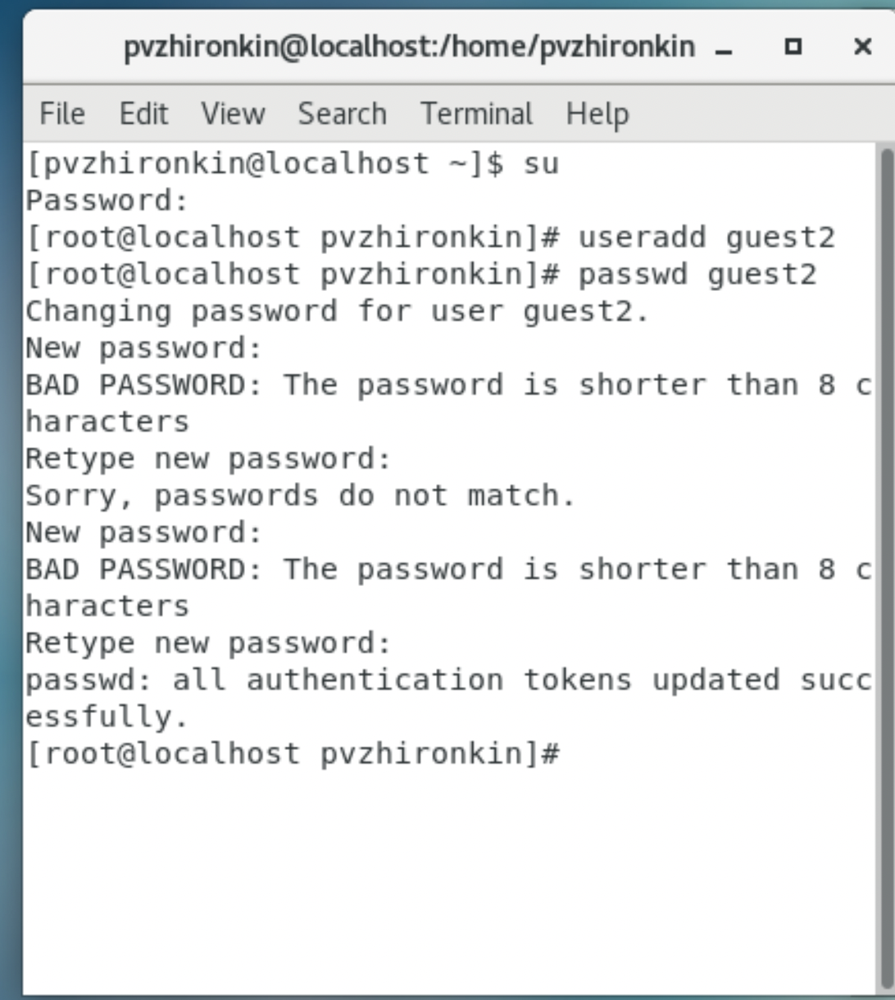
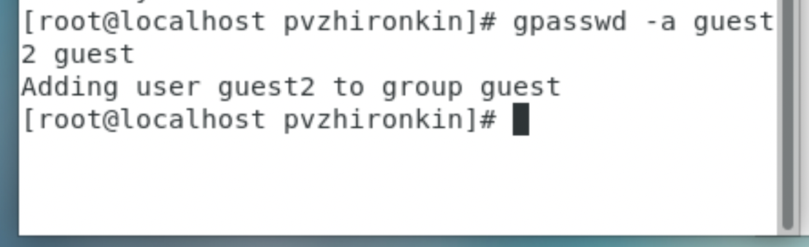

---
## Front matter
lang: ru-RU
title: Отчет по лабораторной работе №3
author: |
	 Жиронкин Павел Владимирович НПИбд-01-18\inst{1}

institute: |
	\inst{1}Российский Университет Дружбы Народов

date: Информационная Безопасность--2021,  13 октября, 2021, Москва, Россия

## Formatting
mainfont: PT Serif
romanfont: PT Serif
sansfont: PT Sans
monofont: PT Mono
toc: false
slide_level: 2
theme: metropolis
header-includes: 
 - \metroset{progressbar=frametitle,sectionpage=progressbar,numbering=fraction}
 - '\makeatletter'
 - '\beamer@ignorenonframefalse'
 - '\makeatother'
aspectratio: 43
section-titles: true

---

# Цели и задачи работы

## Цель лабораторной работы

Получить практические навыки работы в консоли с атрибутами файлов для групп пользователей.

## Задание к лабораторной работе

Лабораторная работа подразумевает выполнение последовательно необходимых действий, чтобы получить навыки работы в консоли с атрибутами файлов для групп пользователей.

# Процесс выполнения лабораторной работы

## Процесс выполнения

1. В установленной операционной системе создал учетную запись пользователя guest (используя учетную запись администратора): useradd guest. Задал пароль для пользователя guest: passwd guest. (Это было выполнено в лабораторной работе №2) Аналогично создал второго пользователя guest2.

2. Добавил пользователя guest2 в группу guest: gpasswd -a guest2 guest.

3. Осуществил вход в систему от двух пользователей на двух разных консолях: guest на первой консоли и guest2 на второй консоли. Для обоих пользователей командой pwd определил директорию, в которой мы находимся.

## Процесс выполнения

4. Уточнил имя пользователя, его группу, кто входит в нее и к каким группам принадлежит он сам. Определил командами groups guest и groups guest2, в какие группы входят пользователи guest и guest2. Сравнил вывод команды groups с выводом команд id -Gn и id -G. (рис. -@fig:001).

{ #fig:001 width=55% height=55% }

## Процесс выполнения

5. Сравнил полученную информацию с содержимым файла /etc/group.

6. От имени пользователя guest2 выполнил регистрацию пользователя guest2 в группе guest командой:
newgrp guest. 

7. От имени пользователя guest изменил права директории /home/guest, разрешив все действия для пользователей группы: chmod g+rwx /home/guest

8. От имени пользователя guest снял с директории /home/guest/dir1 все атрибуты командой
chmod 000 dir1.

## Процесс выполнения

9.  Проверил правильность снятия атрибутов. (рис. -@fig:002). 

{ #fig:002 width=70% height=70% }

## Процесс выполнения

10. Заполнил таблицу «Установленные права и разрешенные действия для групп», определив, какие операции разрешены, а какие нет. Если операция разрешена, занес в таблицу знак «+», если не разрешена, знак «-».

11. На основании заполненной таблицы определил те или иные минимально необходимые права для выполнения пользователем guest2 операций внутри директории dir1 и заполнил таблицу «Минимальные права для совершения операций от имени пользователей входящих в группу»

# Выводы по проделанной работе

## Вывод

На основе проделанной работы получил практические навыки работы в консоли с атрибутами файлов для групп пользователей.
