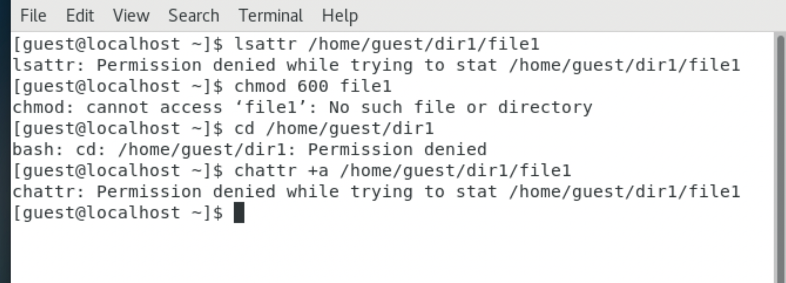
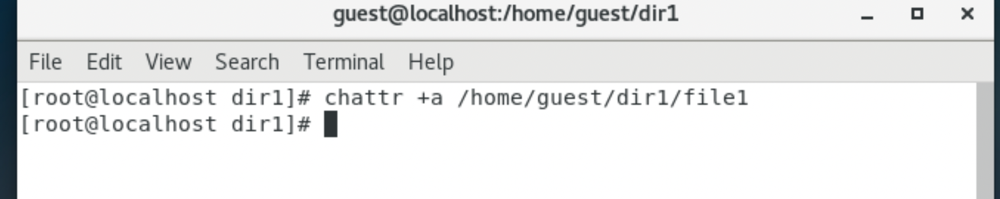
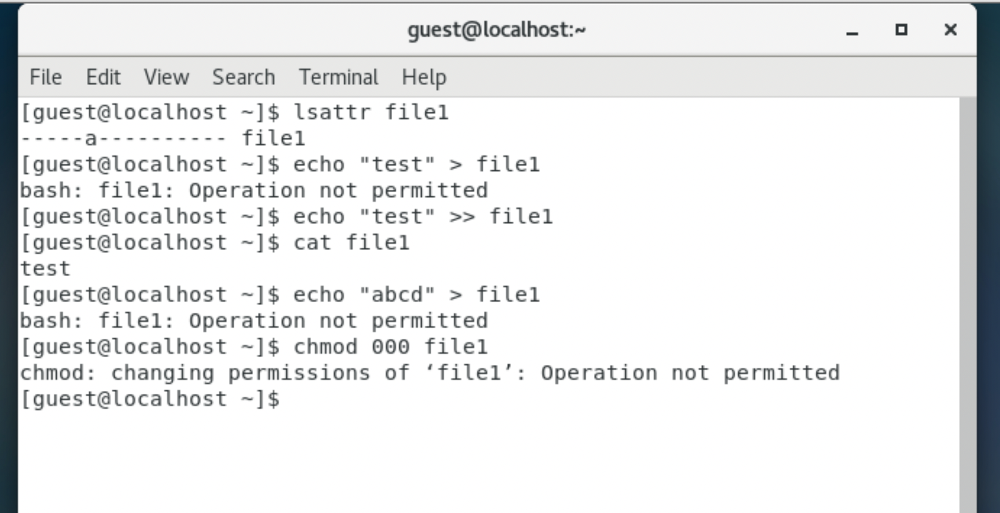
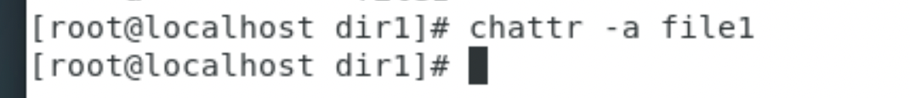
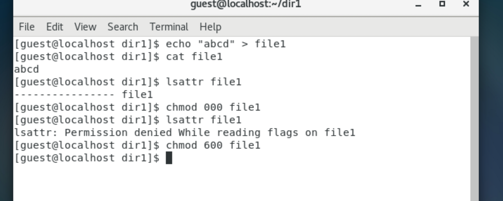
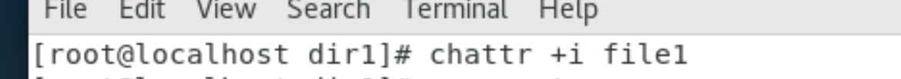
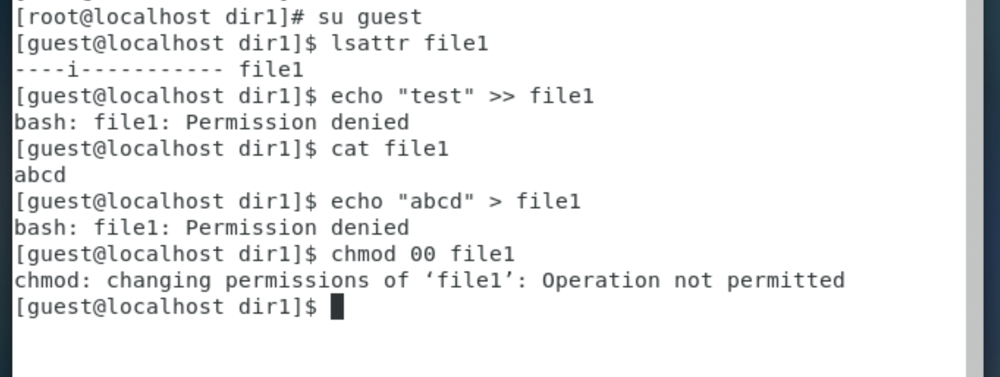
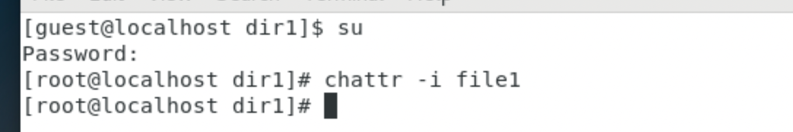
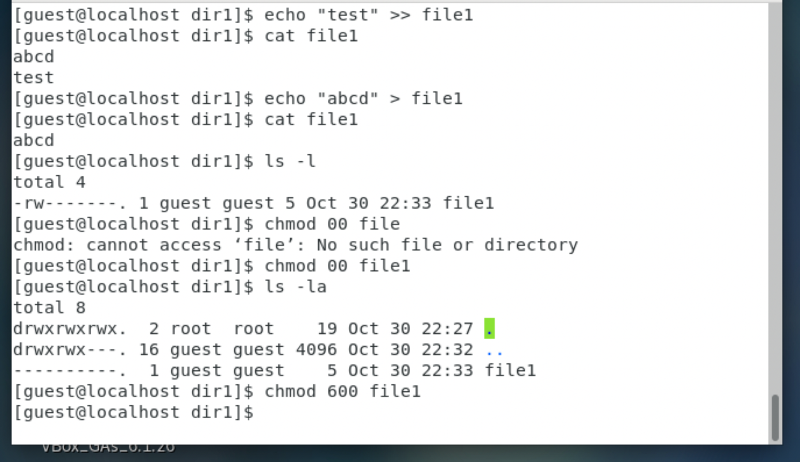

---
# Front matter
lang: ru-RU
title: "Отчет по лабораторной работе №4"
subtitle: "Информационная безопасноть"
author: "Жиронкин Павел Владимирович НПИбд-01-18"

# Formatting
toc-title: "Содержание"
toc: true # Table of contents
toc_depth: 2
lof: true # List of figures
fontsize: 12pt
linestretch: 1.5
papersize: a4paper
documentclass: scrreprt
polyglossia-lang: russian
polyglossia-otherlangs: english
mainfont: PT Serif
romanfont: PT Serif
sansfont: PT Sans
monofont: PT Mono
mainfontoptions: Ligatures=TeX
romanfontoptions: Ligatures=TeX
sansfontoptions: Ligatures=TeX,Scale=MatchLowercase
monofontoptions: Scale=MatchLowercase
indent: true
pdf-engine: lualatex
header-includes:
  - \linepenalty=10 # the penalty added to the badness of each line within a paragraph (no associated penalty node) Increasing the υalue makes tex try to haυe fewer lines in the paragraph.
  - \interlinepenalty=0 # υalue of the penalty (node) added after each line of a paragraph.
  - \hyphenpenalty=50 # the penalty for line breaking at an automatically inserted hyphen
  - \exhyphenpenalty=50 # the penalty for line breaking at an explicit hyphen
  - \binoppenalty=700 # the penalty for breaking a line at a binary operator
  - \relpenalty=500 # the penalty for breaking a line at a relation
  - \clubpenalty=150 # extra penalty for breaking after first line of a paragraph
  - \widowpenalty=150 # extra penalty for breaking before last line of a paragraph
  - \displaywidowpenalty=50 # extra penalty for breaking before last line before a display math
  - \brokenpenalty=100 # extra penalty for page breaking after a hyphenated line
  - \predisplaypenalty=10000 # penalty for breaking before a display
  - \postdisplaypenalty=0 # penalty for breaking after a display
  - \floatingpenalty = 20000 # penalty for splitting an insertion (can only be split footnote in standard LaTeX)
  - \raggedbottom # or \flushbottom
  - \usepackage{float} # keep figures where there are in the text
  - \usepackage{amsmath}
  - \floatplacement{figure}{H} # keep figures where there are in the text
---

# Цель работы

Получить практические навыки работы в консоли с расширенными атрибутами файлов.

# Теоретическое описание

В операционной системе Linux есть много отличных функций безопасности, но она из самых важных - это система прав доступа к файлам. У каждого файла имеется определённый набор свойств в файловой системе. Например, это права доступа, владелец, имя, метки времени. В Linux каждый файл имеет довольно много свойств, например, права доступа устанавливаются трижды (для владельца, группы и всех прочих).

Кроме того файлам и директориям могут быть установлены расширенные атрибуты доступа. Файловые атрибуты могут использовать администраторы и пользователи для защиты файлов от случайных удалений и изменений, а также их применяют злоумышленники, делая невозможным удаление вредоносного файла.

Вот некоторые доступные атрибуты:

a - файл может быть открыт только в режиме добавления; A - не обновлять время перезаписи; c - автоматически сжимать при записи на диск; C - отключить копирование при записи; D - работает только для папки, когда установлен, все изменения синхронно записываются на диск сразу же; e - использовать extent'ы блоков для хранения файла; i - сделать неизменяемым; j - все данные перед записью в файл будут записаны в журнал; s - безопасное удаление с последующей перезаписью нулями; S - синхронное обновление, изменения файлов с этим атрибутом будут сразу же записаны на диск; t - файлы с этим атрибутом не будут хранится в отдельных блоках; u - содержимое файлов с этим атрибутом не будет удалено при удалении самого файла и потом может быть восстановлено.

# Выполнение лабораторной работы

1. От имени пользователя guest определил расширенные атрибуты файла /home/guest/dir1/file1. Установил командой: chmod 600 file1 на файл file1 права, разрешающие чтение и запись для владельца файла. Попробовал установить на файл /home/guest/dir1/file1 расширенный атрибут a от имени пользователя guest: chattr +a /home/guest/dir1/file1. В ответ мы получили отказ от выполнения операции. (рис. -@fig:001). 

{ #fig:001 width=70% height=70% }

2. Попробовал установить расширенный атрибут "a" на файл /home/guest/dir1/file1 от имени суперпользователя. (рис. -@fig:002). 

{ #fig:002 width=70% height=70% }

3. От пользователя guest проверил правильность установления атрибута: lsattr /home/guest/dir1/file1. Выполнил дозапись в файл file1 слова «test» командой: echo "test" /home/guest/dir1/file1. После этого выполнил чтение файла file1 командой cat /home/guest/dir1/file1 и убедился, что слово test успешно записано в file1. Попробовал удалить файл file1, стереть имеющуюся в нем информацию командой: echo "abcd" > /home/guest/dirl/file1. Попробовал с помощью команды: chmod 000 file1 установить на файл file1 права, запрещающие чтение и запись для владельца файла. Все указанные выше команды нам выполнить не удалось, кроме дозаписи и чтения файла. (рис. -@fig:003). 

{ #fig:003 width=70% height=70% }

4. Снял расширенный атрибут "a" с файла /home/guest/dirl/file1 от имени суперпользователя. (рис. -@fig:004). 

{ #fig:004 width=70% height=70% }

5. Повторил операции, которые ранее не удавалось выполнить. После снятия атрибута "а" мы можем выполнять все действия. (рис. -@fig:005).

{ #fig:005 width=70% height=70% }

6. Установил расширенный атрибут "i" на файл /home/guest/dir1/file1 от имени суперпользователя. (рис. -@fig:006).

{ #fig:006 width=70% height=70% }

7. Повторил по шагам наши операции. С установленным атрибутом "i"  нам не удается выполнить ни одного действия. (рис. -@fig:007). 

{ #fig:007 width=70% height=70% }

8. Снял расширенный атрибут "i" с файла /home/guest/dirl/file1 от имени суперпользователя. (рис. -@fig:008). 

{ #fig:008 width=70% height=70% }

9. Снова повторил все операции, после удаления атрибута "i" мы снова можем выполнить все действия. (рис. -@fig:009). 

{ #fig:009 width=50% height=50% }

# Выводы
На основе проделанной работы получил практические навыки работы в консоли с расширенными атрибутами файлов.
