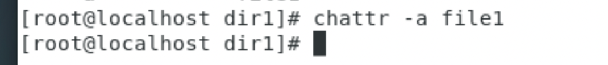

---
## Front matter
lang: ru-RU
title: Отчет по лабораторной работе №4
author: |
	 Жиронкин Павел Владимирович НПИбд-01-18\inst{1}

institute: |
	\inst{1}Российский Университет Дружбы Народов

date: Информационная Безопасность--2021, 19 октября, 2021, Москва, Россия

## Formatting
mainfont: PT Serif
romanfont: PT Serif
sansfont: PT Sans
monofont: PT Mono
toc: false
slide_level: 2
theme: metropolis
header-includes: 
 - \metroset{progressbar=frametitle,sectionpage=progressbar,numbering=fraction}
 - '\makeatletter'
 - '\beamer@ignorenonframefalse'
 - '\makeatother'
aspectratio: 43
section-titles: true

---

# Цели и задачи работы

## Цель лабораторной работы

Получить практические навыки работы в консоли с расширенными атрибутами файлов.

## Задание к лабораторной работе

Лабораторная работа подразумевает выполнение последовательно необходимых действий, чтобы получить навыки работы в консоли с расширенными атрибутами файлов. 

# Процесс выполнения лабораторной работы

## Процесс выполнения

1. От имени пользователя guest определил расширенные атрибуты файла /home/guest/dir1/file1. Установил командой: chmod 600 file1 на файл file1 права, разрешающие чтение и запись для владельца файла. Попробовал установить на файл /home/guest/dir1/file1 расширенный атрибут a от имени пользователя guest: chattr +a /home/guest/dir1/file1. В ответ мы получили отказ от выполнения операции. 

2. Попробовал установить расширенный атрибут "a" на файл /home/guest/dir1/file1 от имени суперпользователя.

## Процесс выполнения

3. От пользователя guest проверил правильность установления атрибута. Выполнил дозапись в файл file1 слова «test» командой: echo "test" /home/guest/dir1/file1. После этого выполнил чтение файла file1 командой cat /home/guest/dir1/file1 и убедился, что слово test успешно записано в file1. Попробовал удалить файл file1, стереть имеющуюся в нем информацию командой: echo "abcd" > /home/guest/dirl/file1. Попробовал с помощью команды: chmod 000 file1 установить на файл file1 права, запрещающие чтение и запись для владельца файла. Все указанные выше команды нам выполнить не удалось, кроме дозаписи и чтения файла. (рис. -@fig:001). 

## Процесс выполнения

{ #fig:001 width=60% height=60% }

## Процесс выполнения

4. Снял расширенный атрибут "a" с файла /home/guest/dirl/file1 от имени суперпользователя.

5. Повторил операции, которые ранее не удавалось выполнить. После снятия атрибута "а" мы можем выполнять все действия. (рис. -@fig:002).

{ #fig:002 width=45% height=45% }

## Процесс выполнения

6. Установил расширенный атрибут "i" на файл /home/guest/dir1/file1 от имени суперпользователя.

7. Повторил по шагам наши операции. С установленным атрибутом "i"  нам не удается выполнить ни одного действия.  (рис. -@fig:003). 

{ #fig:003 width=60% height=60% }

## Процесс выполнения

8. Снял расширенный атрибут "i" с файла /home/guest/dirl/file1 от имени суперпользователя. 

9. Снова повторил все операции, после удаления атрибута "i" мы снова можем выполнить все действия. (рис. -@fig:004). 

{ #fig:004 width=55% height=55% }

# Выводы по проделанной работе

## Вывод

На основе проделанной работы получил практические навыки работы в консоли с расширенными атрибутами файлов.
