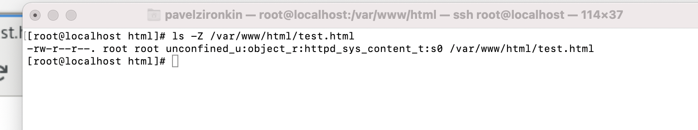
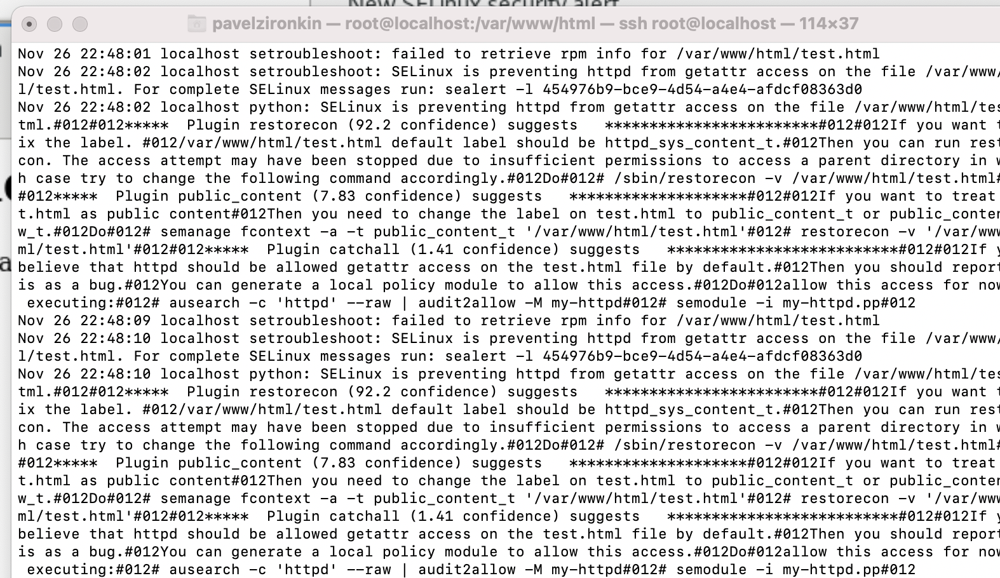

---
# Front matter
lang: ru-RU
title: "Отчет по лабораторной работе №6"
subtitle: "Информационная безопасноть"
author: "Жиронкин Павел Владимирович НПИбд-01-18"

# Formatting
toc-title: "Содержание"
toc: true # Table of contents
toc_depth: 2
lof: true # List of figures
fontsize: 12pt
linestretch: 1.5
papersize: a4paper
documentclass: scrreprt
polyglossia-lang: russian
polyglossia-otherlangs: english
mainfont: PT Serif
romanfont: PT Serif
sansfont: PT Sans
monofont: PT Mono
mainfontoptions: Ligatures=TeX
romanfontoptions: Ligatures=TeX
sansfontoptions: Ligatures=TeX,Scale=MatchLowercase
monofontoptions: Scale=MatchLowercase
indent: true
pdf-engine: lualatex
header-includes:
  - \linepenalty=10 # the penalty added to the badness of each line within a paragraph (no associated penalty node) Increasing the υalue makes tex try to haυe fewer lines in the paragraph.
  - \interlinepenalty=0 # υalue of the penalty (node) added after each line of a paragraph.
  - \hyphenpenalty=50 # the penalty for line breaking at an automatically inserted hyphen
  - \exhyphenpenalty=50 # the penalty for line breaking at an explicit hyphen
  - \binoppenalty=700 # the penalty for breaking a line at a binary operator
  - \relpenalty=500 # the penalty for breaking a line at a relation
  - \clubpenalty=150 # extra penalty for breaking after first line of a paragraph
  - \widowpenalty=150 # extra penalty for breaking before last line of a paragraph
  - \displaywidowpenalty=50 # extra penalty for breaking before last line before a display math
  - \brokenpenalty=100 # extra penalty for page breaking after a hyphenated line
  - \predisplaypenalty=10000 # penalty for breaking before a display
  - \postdisplaypenalty=0 # penalty for breaking after a display
  - \floatingpenalty = 20000 # penalty for splitting an insertion (can only be split footnote in standard LaTeX)
  - \raggedbottom # or \flushbottom
  - \usepackage{float} # keep figures where there are in the text
  - \usepackage{amsmath}
  - \floatplacement{figure}{H} # keep figures where there are in the text
---

# Цель работы

Развить навыки администрирования ОС Linux. Получить первое практическое знакомство с технологией SELinux. Проверить работу SELinx на практике совместно с веб-сервером Apache.

# Теоретическое описание

SELinux — набор технологий расширения системы безопасности Linux. Сегодня основу набора составляют три технологии: мандатный контроль доступа, ролевой доступ RBAC и система типов (доменов). Apache – это свободное программное обеспечение для размещения веб-сервера. Он хорошо показывает себя в работе с масштабными проектами, поэтому заслуженно считается одним из самых популярных веб-серверов. Кроме того, Apache очень гибок в плане настройки, что даёт возможность реализовать все особенности размещаемого веб-ресурса.

# Подготовка лабораторного стенда:

1. В конфигурационном файле /etc/httpd/httpd.conf  задал параметр ServerName. (рис. -@fig:001). 

{ #fig:001 width=60% height=60% }

2. Также проследил, чтобы пакетный фильтр был отключён или в своей рабочей конфигурации позволял подключаться к 80-у и 81-у портам протокола tcp. Отключил фильтр командами: iptables -F, iptables -P INPUT ACCEPT iptables -P OUTPUT ACCEPT. Так же добавил разрешающие правила.
(рис. -@fig:002), (рис. -@fig:003). 

{ #fig:002 width=70% height=70% }

# Выполнение лабораторной работы

1. Вошел в систему с полученными учётными данными и убедился, что SELinux работает в режиме enforcing политики targeted с помощью команд getenforce и sestatus.(рис. -@fig:004). 

{ #fig:004 width=70% height=70% }

2. Обратился с помощью браузера к веб-серверу, запущенному на компьютере, и убедился, что последний работает: service httpd status(рис. -@fig:005), (рис. -@fig:006).

{ #fig:005 width=70% height=70% }

{ #fig:006 width=70% height=70% }

3. Нашел веб-сервер Apache в списке процессов, определил его контекст безопасности. (рис. -@fig:007). 

{ #fig:007 width=70% height=70% }

4. Посмотрел текущее состояние переключателей SELinux для Apache с помощью команды: sestatus -bigrep httpd. Обратил внимание, что многие из них находятся в положении «off». (рис. -@fig:008). 

{ #fig:008 width=70% height=70% }

5. Посмотрел статистику по политике с помощью команды seinfo, также определил множество пользователей(8), ролей(14), типов(4793). Определил тип файлов и поддиректорий, находящихся в директории /var/www, с помощью команды: ls -lZ /var/www. Определил тип файлов, находящихся в директории /var/www/html: ls -lZ /var/www/html. Определил круг пользователей, которым разрешено создание файлов в директории /var/www/html. (рис. -@fig:009). 

{ #fig:009 width=70% height=70% }

6. Создал от имени суперпользователя (так как в дистрибутиве после установки только ему разрешена запись в директорию) html-файл /var/www/html/test.html(рис. -@fig:0010). 

{ #fig:0010 width=70% height=70% }

7. Проверил контекст созданного файла. httpd_sys_content_t (рис. -@fig:0011). 

{ #fig:0011 width=70% height=70% }

8. Обратился к файлу через веб-сервер, введя в браузере адрес http://127.0.0.1/test.html. Убедился, что файл был успешно отображён. (рис. -@fig:0012). 

{ #fig:0012 width=50% height=50% }

9. Проверил контекст файла командой: ls -Z /var/www/html/test.html (рис. -@fig:0013). 

{ #fig:0013 width=50% height=50% }

10. Изменил контекст файла /var/www/html/test.html с httpd_sys_content_t на samba_share_t. После этого проверил, что контекст поменялся. (рис. -@fig:0014). 

{ #fig:0014 width=50% height=50% }

11. Попробовал ещё раз получить доступ к файлу через веб-сервер, введя в
браузере адрес http://127.0.0.1/test.html. Получил сообщение об ошибке. (рис. -@fig:0015).

{ #fig:0015 width=50% height=50% }

12. Проанализировал ситуацию. Файл не был отображён потому что мы изменили контекст файла. Просмотрел log-файлы веб-сервера Apache. Также просмотрел системный лог-файл: tail /var/log/messages (рис. -@fig:0016), (рис. -@fig:0017), (рис. -@fig:0018). 

{ #fig:0016 width=50% height=50% }

{ #fig:0017 width=50% height=50% }

{ #fig:0018 width=50% height=50% }

13. Попробовал запустить веб-сервер Apache на прослушивание ТСР-порта 81 (а не 80, как рекомендует IANA и прописано в /etc/services). Для этого в файле /etc/httpd/httpd.conf нашел строчку Listen 80 и заменил её на Listen 81.(рис. -@fig:0019). 

{ #fig:0019 width=50% height=50% }

14. Проанализиировал лог-файлы. Просмотрел файлы /var/log/http/error_log, /var/log/http/access_log и /var/log/audit/audit.log. (рис. -@fig:0020), (рис. -@fig:0021), (рис. -@fig:0022), (рис. -@fig:0023).

{ #fig:0020 width=50% height=50% }

{ #fig:0021 width=50% height=50% }

{ #fig:0022 width=50% height=50% }

{ #fig:0023 width=50% height=50% }

15. Выполнил команду: semanage port -a -t http_port_t -р tcp 81. После этого проверил список портов командой: semanage port -l | grep http_port_t. Убедился, что порт 81 появился в списке. (рис. -@fig:0024).

{ #fig:0024 width=50% height=50% }

16. Вернул контекст httpd_sys_cоntent__t к файлу /var/www/html/test.html: chcon -t httpd_sys_content_t /var/www/html/test.html. После этого попробовал получить доступ к файлу через веб-сервер, введя в браузере адрес http://127.0.0.1:81/test.html. Увидели содержимое файла — слово «test». (рис. -@fig:0025), (рис. -@fig:0026).

{ #fig:0025 width=50% height=50% }

{ #fig:0026 width=50% height=50% }

17. Исправил обратно конфигурационный файл apache, вернувListen80. (рис. -@fig:0027).

{ #fig:0027 width=50% height=50% }

18. Удалил привязку http_port_t к 81 порту. (рис. -@fig:0028).

{ #fig:0028 width=50% height=50% }

19. Удалил файл /var/www/html/test.html. (рис. -@fig:0029).

{ #fig:0029 width=50% height=50% }

# Выводы
На основе проделанной работы развил навыки администрирования ОС Linux. Получил первое практическое знакомство с технологией SELinux. Проверил работу SELinx на практике совместно с веб-сервером Apache.
