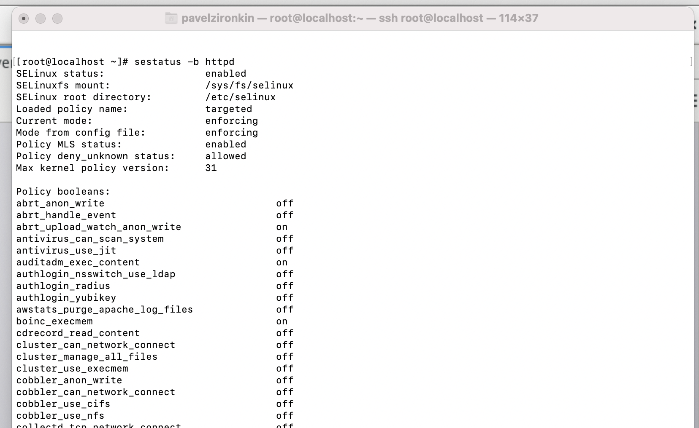
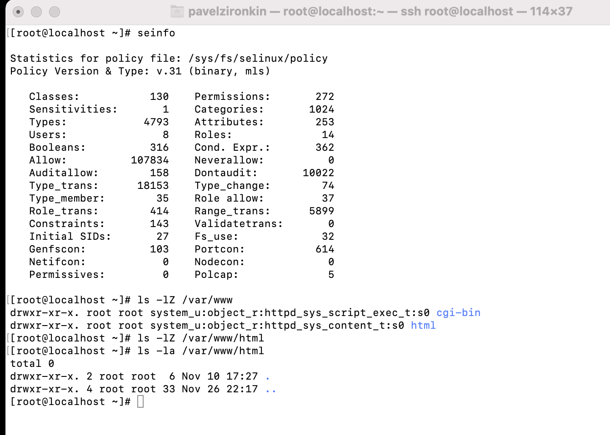
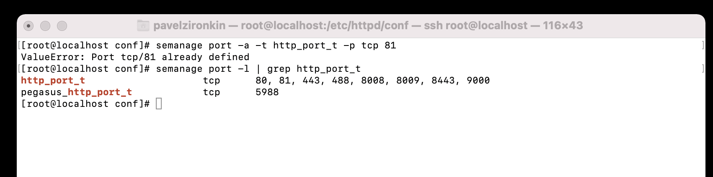

---
## Front matter
lang: ru-RU
title: Отчет по лабораторной работе №6
author: |
	 Жиронкин Павел Влдимирович НПИбд-01-18\inst{1}

institute: |
	\inst{1}Российский Университет Дружбы Народов

date: Информационная Безопасность--2021, 22 ноября, 2021, Москва, Россия

## Formatting
mainfont: PT Serif
romanfont: PT Serif
sansfont: PT Sans
monofont: PT Mono
toc: false
slide_level: 2
theme: metropolis
header-includes: 
 - \metroset{progressbar=frametitle,sectionpage=progressbar,numbering=fraction}
 - '\makeatletter'
 - '\beamer@ignorenonframefalse'
 - '\makeatother'
aspectratio: 43
section-titles: true

---

# Цели и задачи работы

## Цель лабораторной работы

Развить навыки администрирования ОС Linux. Получить первое практическое знакомство с технологией SELinux. Проверить работу SELinx на практике совместно с веб-сервером Apache.

## Задание к лабораторной работе

Лабораторная работа подразумевает выполнение последовательно необходимых действий, чтобы развить навыки администрирования ОС Linux. Получить первое практическое знакомство с технологией SELinux. Проверить работу SELinx на практике совместно с веб-сервером Apache.

# Процесс выполнения лабораторной работы

## Процесс выполнения

1. Вошел в систему с полученными учётными данными и убедился, что SELinux работает в режиме enforcing политики targeted с помощью команд getenforce и sestatus

2. Обратился с помощью браузера к веб-серверу, запущенному на компьютере, и убедился, что последний работает: service httpd status.

3. Нашел веб-сервер Apache в списке процессов, определил его контекст безопасности.

## Процесс выполнения

4. Посмотрел текущее состояние переключателей SELinux для Apache с помощью команды: sestatus -bigrep httpd. Обратил внимание, что многие из них находятся в положении «off». (рис. -@fig:001).

{ #fig:001 width=60% height=60% }

## Процесс выполнения

5. Посмотрел статистику по политике с помощью команды seinfo, также определил множество пользователей(8), ролей(14), типов(4793). Определил тип файлов и поддиректорий, находящихся в директории /var/www, с помощью команды: ls -lZ /var/www. Определил тип файлов, находящихся в директории /var/www/html: ls -lZ /var/www/html. Определил круг пользователей, которым разрешено создание файлов в директории /var/www/html. (рис. -@fig:002). 

## Процесс выполнения

{ #fig:002 width=70% height=70% }

## Процесс выполнения

6. Создал от имени суперпользователя (так как в дистрибутиве после установки только ему разрешена запись в директорию) html-файл /var/www/html/test.html

7. Проверил контекст созданного файла. httpd_sys_content_t

8. Обратился к файлу через веб-сервер, введя в браузере адрес http://127.0.0.1/test.html. Убедился, что файл был успешно отображён.

9.  Проверил контекст файла командой: ls -Z /var/www/html/test.html  

## Процесс выполнения

10.  Изменил контекст файла /var/www/html/test.html с httpd_sys_content_t на samba_share_t. После этого проверил, что контекст поменялся.

11. Попробовал ещё раз получить доступ к файлу через веб-сервер, введя в браузере адрес http://127.0.0.1/test.html. Получили сообщение об ошибке. 

12. Проанализировал ситуацию. Файл не был отображён потому что мы изменили контекст файла. Просмотрел log-файлы веб-сервера Apache. Также просмотрел системный лог-файл

## Процесс выполнения

13. Попробовал запустить веб-сервер Apache на прослушивание ТСР-порта 81 (а не 80, как рекомендует IANA и прописано в /etc/services). Для этого в файле /etc/httpd/httpd.conf нашла строчку Listen 80 и заменил её на Listen 81.

14. Проанализиировал лог-файлы. Просмотрел файлы /var/log/http/error_log, /var/log/http/access_log и /var/log/audit/audit.log.

## Процесс выполнения

15.   Выполнил команду: semanage port -a -t http_port_t -р tcp 81. После этого проверил список портов командой: semanage port -l | grep http_port_t. Убедился, что порт 81 появился в списке. (рис. -@fig:003).

{ #fig:003 width=80% height=80% }

## Процесс выполнения

16. Вернул контекст httpd_sys_cоntent__t к файлу /var/www/html/test.html: chcon -t httpd_sys_content_t /var/www/html/test.html. После этого попробовал получить доступ к файлу через веб-сервер, введя в браузере адрес http://127.0.0.1:81/test.html. Увидели содержимое файла — слово «test»

17. Исправил обратно конфигурационный файл apache, вернувListen80.

18. Удалил привязку http_port_t к 81 порту. 

19. Удалил файл /var/www/html/test.html.

# Выводы по проделанной работе

## Вывод

На основе проделанной работы развил навыки администрирования ОС Linux. Получил первое практическое знакомство с технологией SELinux. Проверил работу SELinx на практике совместно с веб-сервером Apache.
