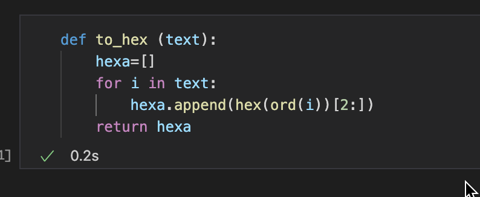
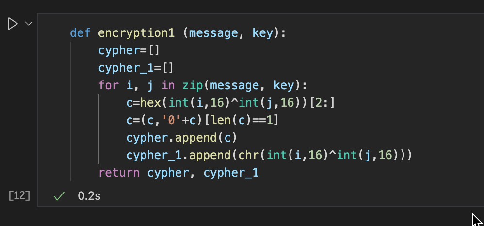
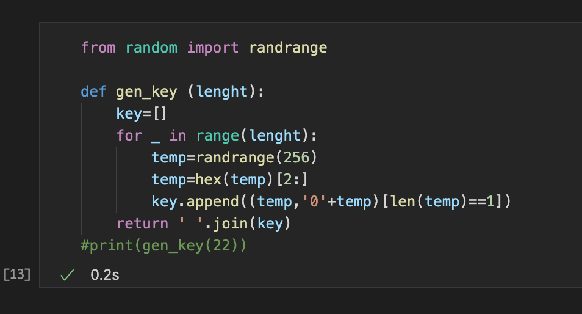
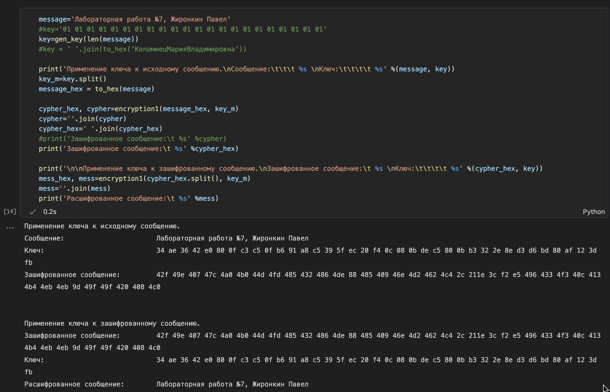
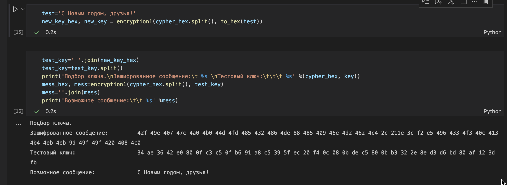

---
# Front matter
lang: ru-RU
title: "Отчет по лабораторной работе №7"
subtitle: "Информационная безопасноть"
author: "Жиронкин Павел Владимирович НПИбд-01-18"

# Formatting
toc-title: "Содержание"
toc: true # Table of contents
toc_depth: 2
lof: true # List of figures
fontsize: 12pt
linestretch: 1.5
papersize: a4paper
documentclass: scrreprt
polyglossia-lang: russian
polyglossia-otherlangs: english
mainfont: PT Serif
romanfont: PT Serif
sansfont: PT Sans
monofont: PT Mono
mainfontoptions: Ligatures=TeX
romanfontoptions: Ligatures=TeX
sansfontoptions: Ligatures=TeX,Scale=MatchLowercase
monofontoptions: Scale=MatchLowercase
indent: true
pdf-engine: lualatex
header-includes:
  - \linepenalty=10 # the penalty added to the badness of each line within a paragraph (no associated penalty node) Increasing the υalue makes tex try to haυe fewer lines in the paragraph.
  - \interlinepenalty=0 # υalue of the penalty (node) added after each line of a paragraph.
  - \hyphenpenalty=50 # the penalty for line breaking at an automatically inserted hyphen
  - \exhyphenpenalty=50 # the penalty for line breaking at an explicit hyphen
  - \binoppenalty=700 # the penalty for breaking a line at a binary operator
  - \relpenalty=500 # the penalty for breaking a line at a relation
  - \clubpenalty=150 # extra penalty for breaking after first line of a paragraph
  - \widowpenalty=150 # extra penalty for breaking before last line of a paragraph
  - \displaywidowpenalty=50 # extra penalty for breaking before last line before a display math
  - \brokenpenalty=100 # extra penalty for page breaking after a hyphenated line
  - \predisplaypenalty=10000 # penalty for breaking before a display
  - \postdisplaypenalty=0 # penalty for breaking after a display
  - \floatingpenalty = 20000 # penalty for splitting an insertion (can only be split footnote in standard LaTeX)
  - \raggedbottom # or \flushbottom
  - \usepackage{float} # keep figures where there are in the text
  - \usepackage{amsmath}
  - \floatplacement{figure}{H} # keep figures where there are in the text
---

# Цель работы

Освоить на практике применение режима однократного гаммирования.

# Теоретическое описание

Предложенная Г. С. Вернамом так называемая «схема однократного использования (гаммирования)» является простой, но надёжной схемой шифрования данных. 
*Гаммирование* представляет собой наложение (снятие) на открытые (зашифрованные) данные последовательности элементов других данных, полученной с помощью некоторого криптографического алгоритма, для получения зашифрованных (открытых) данных. Иными словами, наложение гаммы — это сложение её элементов с элементами открытого (закрытого) текста по некоторому фиксированному модулю, значение которого представляет собой известную часть алгоритма шифрования.
В соответствии с теорией криптоанализа, если в методе шифрования используется однократная вероятностная гамма (однократное гаммирование)
той же длины, что и подлежащий сокрытию текст, то текст нельзя раскрыть. Даже при раскрытии части последовательности гаммы нельзя получить информацию о всём скрываемом тексте.
Наложение гаммы по сути представляет собой выполнение операции сложения по модулю 2 (XOR) (обозначаемая знаком $\oplus$) между элементами гаммы и элементами подлежащего сокрытию текста. Напомним, как работает операция XOR над битами: $0 \oplus 0 = 0, 0 \oplus 1 = 1, 1 \oplus 0 = 1, 1 \oplus 1 = 0$.
Такой метод шифрования является симметричным, так как двойное прибавление одной и той же величины по модулю 2 восстанавливает исходноезначение, а шифрование и расшифрование выполняется одной и той же программой.
Если известны ключ и открытый текст, то задача нахождения шифротекста заключается в применении к каждому символу открытого текста следующего правила:
$$C_i = P_i \oplus K_i$$
где $C_i$ — i-й символ получившегося зашифрованного послания, $P_i$ — i-й символ открытого текста, $K_i$ — i-й символ ключа, i = 1, m. Размерности открытого текста и ключа должны совпадать, и полученный шифротекст будет такой же длины.
Если известны шифротекст и открытый текст, то задача нахождения ключа решается также, а именно, обе части равенства необходимо сложить по модулю 2 с $P_i$:
$$C_i \oplus P_i = P_i \oplus K_i \oplus P_i = K_i, K_i = C_i \oplus P_i.$$
Открытый текст имеет символьный вид, а ключ — шестнадцатеричное представление. Ключ также можно представить в символьном виде, воспользовавшись таблицей ASCII-кодов.
К. Шеннон доказал абсолютную стойкость шифра в случае, когда однократно используемый ключ, длиной, равной длине исходного сообщения, является фрагментом истинно случайной двоичной последовательности с равномерным законом распределения. Криптоалгоритм не даёт никакой информации об открытом тексте: при известном зашифрованном сообщении C все различные ключевые последовательности K возможны и равновероятны, а значит, возможны и любые сообщения P.
Необходимые и достаточные условия абсолютной стойкости шифра:
– полная случайность ключа;
– равенство длин ключа и открытого текста;
– однократное использование ключа.

# Выполнение лабораторной работы

Требуется разработать приложение, позволяющее шифровать и дешифровать данные в режиме однократного гаммирования. 

1. Написана функция *to_hex*, трансформирующая текст в шестнадцатиричное представление (рис. -@fig:001). 

{ #fig:001 width=70% height=70% }
 
2. Написана функция *encryption*, которая с помощью однократного гаммирования из сообщения и ключа получает шифротекст (рис. -@fig:002). 

{ #fig:002 width=70% height=70% }

3. Написана функция *gen_key*, генерирующая случайный ключ (рис. -@fig:002).

{ #fig:003 width=70% height=70% }

4. Определяю вид шифротекста при известном ключе и известном открытом тексте. Применяю к шифротексту ключ снова, чтобы получить исходное сообщение (рис. -@fig:004). 

{ #fig:004 width=70% height=70% }

5. Определяю ключ, с помощью которого шифротекст может быть преобразован в некоторый фрагмент текста, представляющий собой один из
возможных вариантов прочтения открытого текста (Нужно подобрать ключ, чтобы получить сообщение «С Новым Годом,
друзья!»)(рис. -@fig:005). 

{ #fig:005 width=70% height=70% }

# Выводы

На основе проделанной работы освоил на практике применение режима однократного гаммирования.

# Контрольные вопросы

1. Поясните смысл однократного гаммирования.
Смысл однократного гаммирования состоит в том, что каждый символ попарно с символом ключа складываются по модулю.

2. Перечислите недостатки однократного гаммирования.
Недостатками является то, что ключ нельзя переиспользовать,  а также размер ключа должен быть равен размеру текста.

3. Перечислите преимущества однократного гаммирования.
Основными преимуществами являются симметричность и криптостойкость. 

4. Почему длина открытого текста должна совпадать с длиной ключа?
Каждый символ открытого текста должен попарно складываться с символом ключа.

5. Какая операция используется в режиме однократного гаммирования, назовите её особенности?
В режиме однократного гаммирования используется сложение по модулю 2: при сложении чисел с другим получается исходное. Например, 0+0 = 0, 0+1=1, 1+0=1, 1+1=0. Если в методе шифрования используется однократная вероятностная гамма той же длины, что и подлежащий сокрытию текст, то текст нельзя раскрыть.

6. Как по открытому тексту и ключу получить шифротекст?
Для этого необходимо сложить попарно символы текста с ключом по модулю 2.

7. Как по открытому тексту и шифротексту получить ключ?
Для этого необходимо сложить попарно по модулю 2 символы открытого текста с символами шифротекста.

8. В чём заключаются необходимые и достаточные условия абсолютной стойкости шифра?
Необходимые и достаточные условия абсолютной стойкости шифра заключаются в полной случайности ключа; равенстве длин ключа и открытого текста; использовании ключа однократно.

