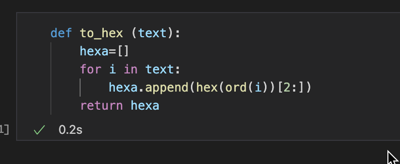
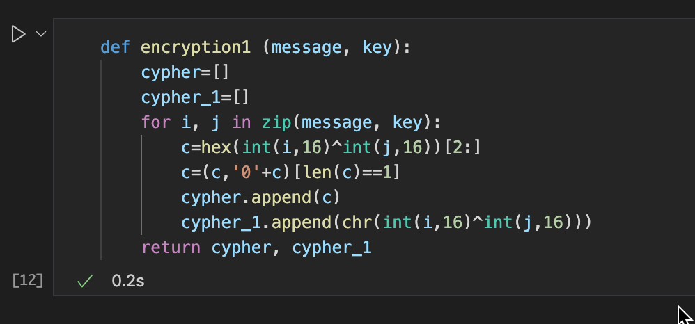
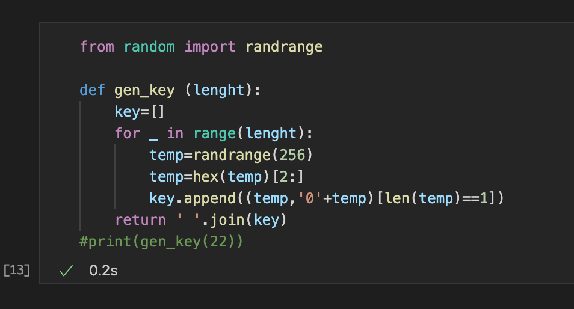
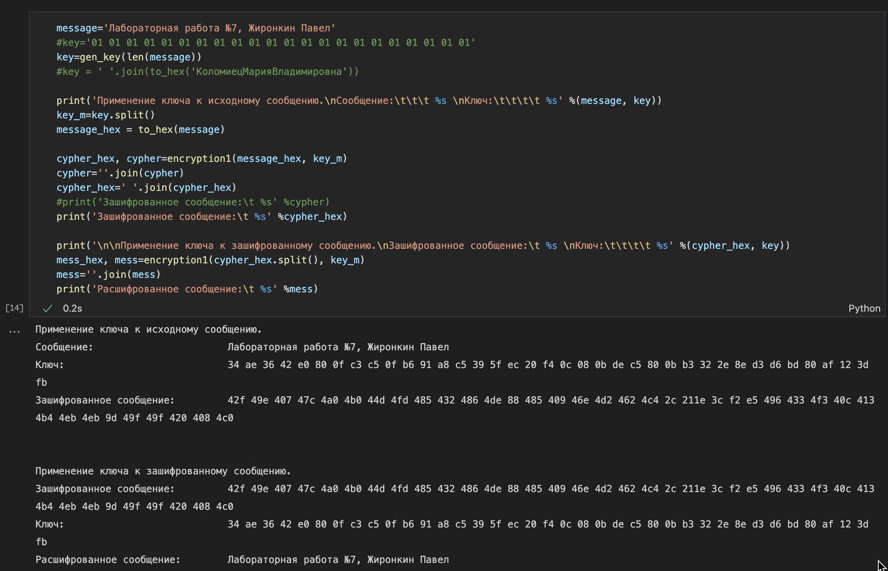
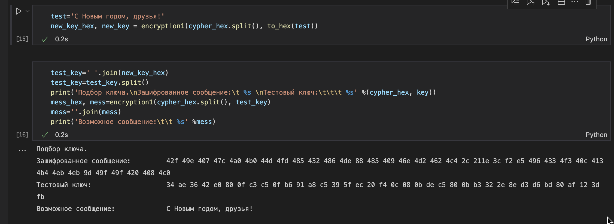

---
## Front matter
lang: ru-RU
title: Отчет по лабораторной работе №7
author: |
	 Жиронкин Павел Владимирович НПИбд-01-18\inst{1}

institute: |
	\inst{1}Российский Университет Дружбы Народов

date: Информационная Безопасность--2021, 7 декабря, 2021, Москва, Россия

## Formatting
mainfont: PT Serif
romanfont: PT Serif
sansfont: PT Sans
monofont: PT Mono
toc: false
slide_level: 2
theme: metropolis
header-includes: 
 - \metroset{progressbar=frametitle,sectionpage=progressbar,numbering=fraction}
 - '\makeatletter'
 - '\beamer@ignorenonframefalse'
 - '\makeatother'
aspectratio: 43
section-titles: true

---

# Цели и задачи работы

## Цель лабораторной работы

Освоить на практике применение режима однократного гаммирования.

## Задание к лабораторной работе

Нужно подобрать ключ, чтобы получить сообщение «С Новым Годом, друзья!». Требуется разработать приложение, позволяющее шифровать и дешифровать данные в режиме однократного гаммирования. Приложение должно:
1. Определить вид шифротекста при известном ключе и известном открытом тексте.
2. Определить ключ, с помощью которого шифротекст может быть преобразован в некоторый фрагмент текста, представляющий собой один из возможных вариантов прочтения открытого текста.

# Процесс выполнения лабораторной работы

## Процесс выполнения

1. Написана функция *to_hex*, трансформирующая текст в шестнадцатиричное представление (рис. -@fig:001). 

{ #fig:001 width=70% height=70% }

## Процесс выполнения

2. Написана функция *encryption*, которая с помощью однократного гаммирования из сообщения и ключа получает шифротекст (рис. -@fig:002). 

{ #fig:002 width=70% height=70% }

## Процесс выполнения

3.Написана функция *gen_key*, генерирующая случайный ключ (рис. -@fig:003).

{ #fig:003 width=70% height=70% }

## Процесс выполнения

4. Определяю вид шифротекста при известном ключе и известном открытом тексте. Применяю к шифротексту ключ снова, чтобы получить исходное сообщение (рис. -@fig:004). 

{ #fig:004 width=70% height=70% }

## Процесс выполнения

5. Определяю ключ, с помощью которого шифротекст может быть преобразован в некоторый фрагмент текста, представляющий собой один из
возможных вариантов прочтения открытого текста (Нужно подобрать ключ, чтобы получить сообщение «С Новым Годом, друзья!»)(рис. -@fig:005). 

{ #fig:005 width=70% height=70% }

# Выводы по проделанной работе

## Вывод

На основе проделанной работы освоил на практике применение режима однократного гаммирования.

# Контрольные вопросы

## Контрольные вопросы

1. Поясните смысл однократного гаммирования.
2. Перечислите недостатки однократного гаммирования.
3. Перечислите преимущества однократного гаммирования.
4. Почему длина открытого текста должна совпадать с длиной ключа?

## Контрольные вопросы

5. Какая операция используется в режиме однократного гаммирования, назовите её особенности?
6. Как по открытому тексту и ключу получить шифротекст?
7. Как по открытому тексту и шифротексту получить ключ?
8. В чём заключаются необходимые и достаточные условия абсолютной стойкости шифра?

