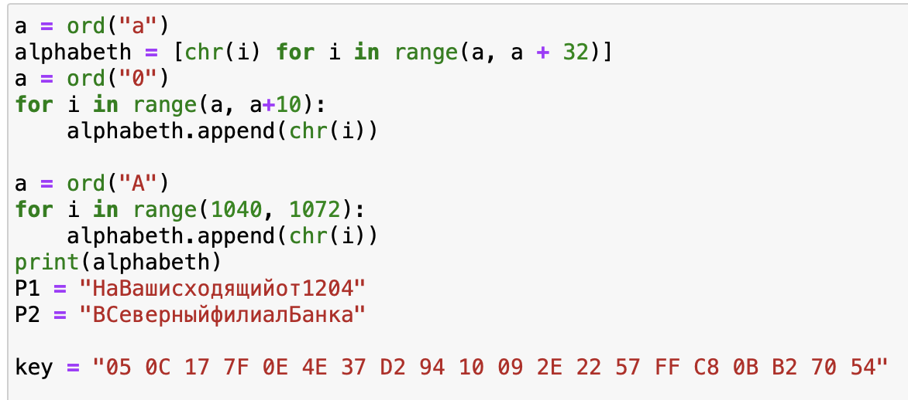
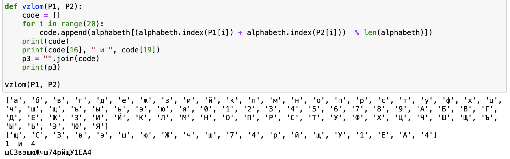
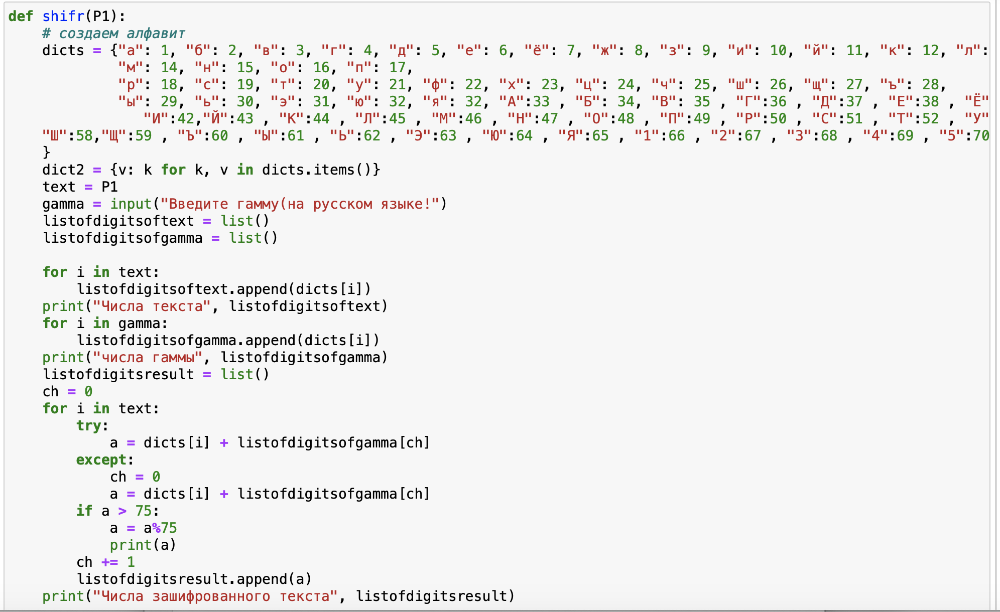
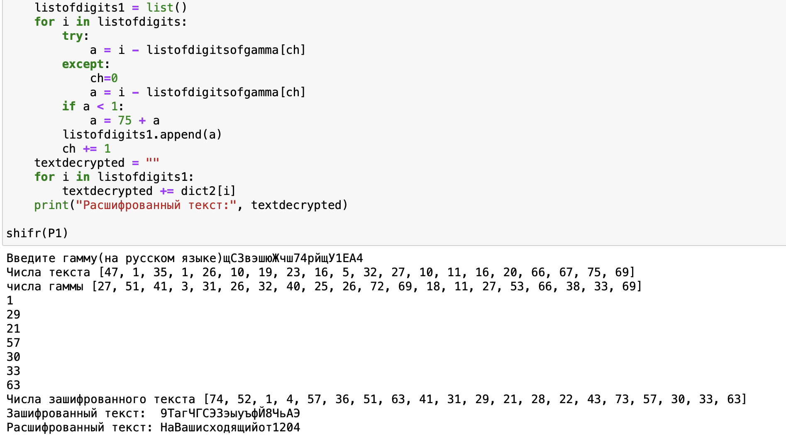

---
## Front matter
lang: ru-RU
title: Отчет по лабораторной работе №8
author: |
	 Жиронкин Павел Владимирович НПИбд-01-18\inst{1}

institute: |
	\inst{1}Российский Университет Дружбы Народов

date: Информационная Безопасность--2021, 10 декабря, 2021, Москва, Россия

## Formatting
mainfont: PT Serif
romanfont: PT Serif
sansfont: PT Sans
monofont: PT Mono
toc: false
slide_level: 2
theme: metropolis
header-includes: 
 - \metroset{progressbar=frametitle,sectionpage=progressbar,numbering=fraction}
 - '\makeatletter'
 - '\beamer@ignorenonframefalse'
 - '\makeatother'
aspectratio: 43
section-titles: true

---

# Цели и задачи работы

## Цель лабораторной работы

Освоить на практике применение режима однократного гаммирования на примере кодирования различных исходных текстов одним ключом.

## Задание к лабораторной работе

Два текста кодируются одним ключом. Требуется, не зная ключа и не стремясь его определить, прочитать оба текста. Необходимо разработать приложение, позволяющее шифровать и дешифровать тексты P1 и P2 в режиме однократного гаммирования. Приложение должно определить вид шифротекстов C1 и C2 обоих текстов P1 и P2 при известном ключе. Необходимо определить и выразить аналитически способ, при котором злоумышленник может прочитать оба текста, не зная ключа и не стремясь его определить.

# Процесс выполнения лабораторной работы

## Процесс выполнения

1. Создаем алфавит из русских букв и цифр. Задаем входные данные из условия лабораторной работы. (рис. -@fig:001).

{ #fig:001 width=50% height=50% }

## Процесс выполнения

2. Функция "vzlom", которая получив два открытых сообщения и объединив их получает гамму. (рис. -@fig:002).

{ #fig:002 width=50% height=50% }

## Процесс выполнения

3. Функция "shifr", которая получает исходные сообщения (рис. -@fig:003).

{ #fig:003 width=50% height=50% }

## Процесс выполнения

4. Алгоритм расшифровки, вывод программы. (рис. -@fig:004).

{ #fig:004 width=50% height=50% }

# Выводы по проделанной работе

## Вывод

На основе проделанной работы освоил на практике применение режима однократного гаммирования на примере кодирования различных исходных текстов одним ключом.

# Контрольные вопросы

## Контрольные вопросы

1. Как, зная один из текстов (P1 или P2), определить другой, не зная при этом ключа?
2. Что будет при повторном использовании ключа при шифровании текста?
3. Как реализуется режим шифрования однократного гаммирования одним ключом двух открытых текстов?
4. Перечислите недостатки шифрования одним ключом двух открытых текстов.
5. Перечислите преимущества шифрования одним ключом двух открытых текстов.
